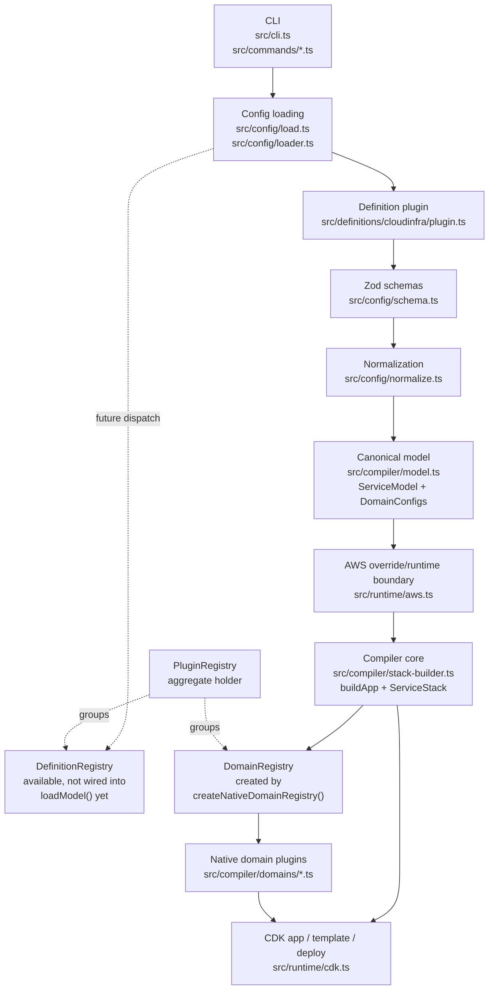
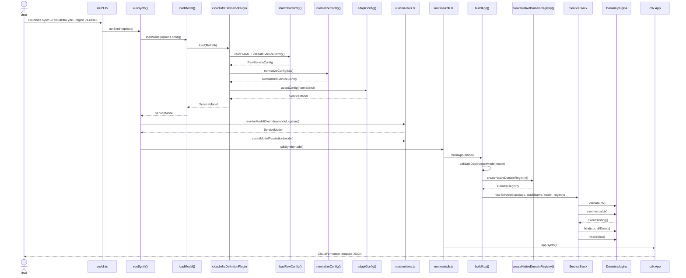

# cloudinfra architecture

This document describes the **current pluginized architecture** implemented in this repository. It is intentionally aligned with the code under `src/compiler/plugins/`, `src/compiler/domains/`, `src/definitions/cloudinfra/`, `src/config/`, and `src/runtime/`.

At a high level, `cloudinfra` is a compiler pipeline:

1. load a YAML definition,
2. validate and normalize it,
3. adapt it into a canonical `ServiceModel`,
4. run ordered domain plugins to build CDK constructs,
5. synthesize or deploy through the runtime layer.

The key design choice is that **definition formats** and **AWS service domains** are separate plugin axes.

## Architectural goals

The current design is optimizing for a few explicit goals:

- **Canonical model first.** Definition formats should compile into a shared, format-agnostic `ServiceModel` before infrastructure synthesis starts.
- **Schema-first typing.** Zod schemas are the source of truth, with TypeScript types derived from `z.infer<>` so runtime validation and static typing stay aligned.
- **Domain isolation.** Each AWS service area is implemented as a `DomainPlugin` with narrow lifecycle hooks instead of a monolithic compiler.
- **Open-ended domain growth.** Domain-specific configuration lives in `DomainConfigs`, so new domains can be added without expanding the top-level `ServiceModel` shape every time.
- **Ordered composition, not hidden coupling.** Cross-domain collaboration happens through explicit compiler phases, shared `CompilationContext`, `ctx.refs`, and aggregated `EventBinding[]`.

## High-level component view



## Separation of concerns

### Config layer

The config layer lives in `src/config/`:

- `load.ts` reads YAML from disk and parses it with `js-yaml`.
- `schema.ts` defines the raw and normalized Zod schemas.
- `normalize.ts` fills defaults and computes derived values such as `stackName`.
- `loader.ts` is the entry point that turns a file path into a `ServiceModel`.

This layer is responsible for **file parsing, schema validation, and normalization**, but not for building CDK constructs.

### Definition layer

The definition layer translates a specific source format into the compiler's canonical model.

Today the active definition plugin is `cloudinfraDefinitionPlugin` in `src/definitions/cloudinfra/plugin.ts`. Its job is to:

- accept a file,
- parse and normalize it,
- adapt it into the canonical `ServiceModel`,
- populate `DomainConfigs` for native domains.

This is where format-specific concerns are supposed to stop.

### Compiler layer

The compiler core lives mostly in:

- `src/compiler/model.ts`
- `src/compiler/stack-builder.ts`
- `src/compiler/plugins/*.ts`
- `src/compiler/domains/*.ts`

Its job is to orchestrate a domain-agnostic lifecycle and provide shared compiler state:

- the canonical model,
- a shared `CompilationContext`,
- a `refs` map of logical names to synthesized CDK constructs,
- aggregated `EventBinding[]` values produced during synthesis.

### Runtime layer

The runtime layer lives in `src/runtime/` and handles execution concerns outside the compiler model:

- `aws.ts` applies CLI AWS overrides and re-validates them.
- `cdk.ts` calls `buildApp`, synthesizes templates, invokes the CDK CLI, or uses direct CloudFormation deploy when configured.

## Canonical model: `ServiceModel` and `DomainConfigs`

### `ServiceModel`

`src/compiler/model.ts` defines the canonical compiler representation.

There are two related shapes:

- `ServiceModelData`: the serializable portion described by `serviceModelSchema`
- `ServiceModel`: `ServiceModelData` plus `readonly domainConfigs: DomainConfigs`

`ServiceModel` intentionally keeps only the compiler-wide fields that every domain needs:

- `service`
- `stackName`
- `provider`
- `functions`
- `iam`
- `domainConfigs`

That means domain-specific top-level sections such as S3 buckets, DynamoDB tables, SQS queues, SNS topics, and API-specific settings do **not** keep expanding the main interface. They are moved into `DomainConfigs`.

### `FunctionModel` and `EventDeclaration`

Functions remain part of the canonical model because they are central to multiple domains.

`FunctionModel` contains:

- handler/runtime/build information,
- environment and IAM references,
- `events: EventDeclaration[]`.

`EventDeclaration` is a discriminated union covering:

- `http`
- `rest`
- `s3`
- `sqs`
- `sns`
- `dynamodb-stream`
- `eventbridge`

One important boundary is documented directly in `model.ts`: definition plugins are expected to resolve format-specific defaults before events reach domain plugins. For example, `cloudinfraDefinitionPlugin` resolves REST API key settings before emitting canonical `rest` events.

### `DomainConfigs`

`src/compiler/plugins/domain-configs.ts` defines `DomainConfigs`, a typed runtime store keyed by `DomainConfigKey<T>`.

This is the core mechanism that keeps the canonical model open to new domains:

- a definition plugin writes domain slices with `domainConfigs.set(key, value)`,
- a domain plugin reads its slice with `get()` or `require()`,
- optional Zod schemas attached to keys validate values at write time.

Native keys are defined in `src/compiler/plugins/native-domain-configs.ts`:

- `S3_CONFIG`
- `DYNAMODB_CONFIG`
- `SQS_CONFIG`
- `SNS_CONFIG`
- `APIS_CONFIG`

Those keys carry schemas, so the native domain config slices are validated when the definition plugin populates the store.

### Why this split matters

The canonical `ServiceModel` answers: **what does the compiler always need to know?**

`DomainConfigs` answers: **what extra typed data does a specific domain own?**

That split lets the compiler stay stable while domain coverage grows.

## Definition plugins vs domain plugins

### Definition plugins

`src/compiler/plugins/definition-plugin.ts` defines:

- `formatName`
- `canLoad(filePath)`
- `load(filePath): ServiceModel`
- optional `generateStarter()`

Definition plugins own the **format-to-model** translation step.

Current built-in definition plugin:

- `cloudinfraDefinitionPlugin` (`src/definitions/cloudinfra/plugin.ts`)

Its `canLoad()` currently matches any `.yml` or `.yaml` path, which fits the current loader because `src/config/loader.ts` routes all YAML files through this plugin.

Its current pipeline is:

1. `loadRawConfig(filePath)` from `src/config/load.ts`
2. `validateServiceConfig()` via `serviceConfigSchema`
3. `normalizeConfig()` via `normalizedServiceConfigSchema`
4. `adaptConfig()` into the canonical `ServiceModel`
5. `parseServiceModel()` before returning

`cloudinfraDefinitionPlugin` also provides `generateStarter()`, which is what `src/commands/init.ts` uses to create starter configs.

### Domain plugins

`src/compiler/plugins/domain-plugin.ts` defines:

- `validate(ctx)`
- `synthesize(ctx)`
- `bind(ctx, events)`
- `finalize(ctx)`

Domain plugins own the **model-to-CDK** step for a specific infrastructure area.

Current native domains are registered from `src/compiler/domains/index.ts`:

1. `s3Domain`
2. `dynamodbDomain`
3. `sqsDomain`
4. `snsDomain`
5. `functionsDomain`
6. `eventbridgeDomain`
7. `apisDomain`

The key distinction is:

- **definition plugins** translate source files into the compiler's canonical language,
- **domain plugins** translate that canonical language into CDK constructs and bindings.

## Registries

The registry types live in `src/compiler/plugins/registry.ts`.

### `DomainRegistry`

`DomainRegistry` stores `DomainPlugin`s in a `Map<string, DomainPlugin>` keyed by plugin name.

Properties of the current implementation:

- duplicate domain names are rejected,
- `all()` returns plugins in insertion order,
- insertion order is meaningful because the compiler executes lifecycle phases in that order.

This registry is actively used today. `createNativeDomainRegistry()` in `src/compiler/domains/index.ts` registers the native domains and hands the registry to `ServiceStack`.

### `DefinitionRegistry`

`DefinitionRegistry` stores `DefinitionPlugin`s in an ordered array.

Properties of the current implementation:

- duplicate `formatName` values are rejected,
- `resolve(filePath)` returns the first plugin whose `canLoad(filePath)` matches,
- registration order therefore defines dispatch priority.

The registry type is real, but current loading is not routed through it yet. `src/config/loader.ts` currently hardcodes `cloudinfraDefinitionPlugin`.

### `PluginRegistry`

`PluginRegistry` is a thin aggregate object:

- `domains = new DomainRegistry()`
- `definitions = new DefinitionRegistry()`

It represents the intended combined registry shape, but it is not currently the root of application startup. The active code path instantiates `DomainRegistry` directly and uses the cloudinfra definition plugin directly.

## Compiler lifecycle

The compiler lifecycle to preserve is:

**load -> validate -> synthesize -> bind -> finalize**

The first stage happens before `ServiceStack` exists; the remaining stages are executed by `ServiceStack` in `src/compiler/stack-builder.ts`.

| Stage | Primary code | What happens |
| --- | --- | --- |
| `load` | `src/config/load.ts`, `src/config/schema.ts`, `src/config/normalize.ts`, `src/definitions/cloudinfra/plugin.ts`, `src/config/loader.ts`, `src/runtime/aws.ts` | YAML is parsed, raw config is Zod-validated, defaults are normalized, the canonical `ServiceModel` is produced, and CLI AWS overrides are applied and re-validated. |
| `validate` | `ServiceStack` phase 1 + `domain.validate?.(ctx)` | Domains reject invalid or inconsistent state before construct creation. |
| `synthesize` | `ServiceStack` phase 2 + `domain.synthesize?.(ctx)` | Domains create CDK constructs, write them into `ctx.refs`, and optionally return `EventBinding[]`. |
| `bind` | `ServiceStack` phase 3 + `domain.bind?.(ctx, allEvents)` | Domains wire event sources and APIs to already-created resources using the aggregated bindings. |
| `finalize` | `ServiceStack` phase 4 + `domain.finalize?.(ctx)` | Final post-processing hook for outputs or cleanup. The hook exists even though the native domains currently do not use it. |

### Load stage in more detail

The load stage has multiple sub-steps:

1. `loadRawConfig()` reads YAML and immediately calls `validateServiceConfig()` from `src/config/schema.ts`.
2. `normalizeConfig()` fills defaults such as:
   - `provider.stage` defaulting to `"dev"`
   - `provider.region` defaulting from config, `AWS_REGION`, or `"us-east-1"`
   - `stackName` defaulting to a sanitized `<service>-<stage>` form
   - empty objects for `functions`, `storage`, `messaging`, and `iam`
3. `adaptConfig()` in `src/definitions/cloudinfra/plugin.ts` converts `NormalizedServiceConfig` into the canonical `ServiceModel`.
4. `adaptDomainConfigs()` writes native domain slices into `DomainConfigs`.
5. `loadModel()` returns the parsed model.
6. CLI commands that accept AWS flags call `resolveModelOverrides()` and `assertModelResolution()` from `src/runtime/aws.ts`.

### Validate stage

Examples of current validation responsibilities:

- `s3Domain.validate()` rejects `autoDeleteObjects: true` without `provider.s3.cleanupRoleArn`.
- `functionsDomain.validate()` rejects functions that mix a direct IAM role ARN with named IAM statement references.

### Synthesize stage

During synthesis, domains create constructs and publish them into `ctx.refs`.

Examples:

- `s3Domain.synthesize()` creates buckets.
- `dynamodbDomain.synthesize()` creates tables.
- `sqsDomain.synthesize()` creates queues.
- `snsDomain.synthesize()` creates topics and wires configured SNS-to-SQS subscriptions.
- `functionsDomain.synthesize()` creates Lambda functions, resolves IAM statement refs against `ctx.refs`, and returns `EventBinding[]`.

`EventBinding` is the bridge between synthesis and binding. It is defined as:

- model-level `EventDeclaration`
- plus `functionName`
- plus the concrete Lambda `fnResource`

### Bind stage

Binding is where event-producing declarations become real connections:

- `s3Domain.bind()` attaches S3 notifications to Lambda destinations.
- `dynamodbDomain.bind()` attaches DynamoDB Streams event sources.
- `sqsDomain.bind()` attaches SQS event sources.
- `snsDomain.bind()` subscribes Lambdas to topics.
- `eventbridgeDomain.bind()` creates rules targeting Lambdas.
- `apisDomain.bind()` creates HTTP API and REST API routes and related outputs.

### Finalize stage

`finalize` exists as part of the plugin contract, but none of the current native domains implement it. In practice, some outputs are emitted earlier during binding; for example `apisDomain.bind()` currently emits API URL outputs there.

## Native domain plugins and why ordering matters

The native domain list in `src/compiler/domains/index.ts` is not cosmetic. `DomainRegistry.all()` preserves the registration order, and `ServiceStack` runs every lifecycle phase in that order.

Current order:

1. `s3`
2. `dynamodb`
3. `sqs`
4. `sns`
5. `functions`
6. `eventbridge`
7. `apis`

Why the current order matters:

- **Earlier domains populate `ctx.refs` for later domains.**  
  `functionsDomain.synthesize()` resolves IAM statement resource refs through `resolveIamPolicy(statement, ctx.refs)`, so resources such as S3 buckets, DynamoDB tables, SQS queues, and SNS topics must already exist in `ctx.refs`.

- **Some domains validate against constructs created by earlier domains.**  
  `snsDomain.synthesize()` checks that SQS subscription targets already exist in `ctx.refs` before wiring SNS-to-SQS subscriptions, which is one reason `sqs` is registered before `sns`.

- **Function creation must happen before event binding.**  
  `functionsDomain.synthesize()` is the stage that creates Lambda constructs and returns `EventBinding[]`. Binding-only domains such as `eventbridgeDomain` and `apisDomain` depend on those bindings.

- **API and event binding domains are intentionally later.**  
  `eventbridgeDomain` and `apisDomain` do not own earlier resource creation; they consume the aggregated function event bindings after the function resources exist.

The current system does **not** declare dependencies between domains. Ordering is a hardcoded policy in `nativeDomains`, so maintainers should treat reorderings as semantic changes.

## Zod validation boundaries and schema-first typing

This repo uses Zod at multiple boundaries, with TypeScript types inferred from the schemas rather than handwritten in parallel.

### 1. Raw YAML boundary

`src/config/schema.ts` defines `serviceConfigSchema` and `validateServiceConfig(input)`.

This boundary validates the file as read from YAML:

- many sections are optional,
- it reflects what users are allowed to omit before normalization.

The corresponding inferred type is `RawServiceConfig`.

### 2. Normalized config boundary

`src/config/normalize.ts` returns `normalizedServiceConfigSchema.parse(...)`.

This boundary ensures defaults have been applied and the compiler now has a complete normalized shape:

- `provider.region` is required,
- `provider.stage` is required,
- `functions`, `storage`, `messaging`, and `iam` are present,
- `stackName` exists.

The corresponding inferred type is `NormalizedServiceConfig`.

### 3. Canonical service-model boundary

`src/compiler/model.ts` defines:

- `eventDeclarationSchema`
- `functionModelSchema`
- `providerConfigSchema`
- `iamConfigSchema`
- `serviceModelSchema`

This is the compiler's format-agnostic boundary.

One nuance matters here: `DomainConfigs` is a runtime class instance, so it is not represented directly in Zod. The serializable fields are validated by `serviceModelSchema`, while runtime checks for the model shape happen outside pure schema parsing. For example:

- `parseServiceModel()` ensures a `domainConfigs` field is present and parses the serializable fields.
- `buildApp()` uses a stricter `isServiceModel()` guard that also checks `domainConfigs instanceof DomainConfigs` before deciding whether it can reuse the input as a canonical model.

### 4. Domain-config boundary

`src/compiler/plugins/native-domain-configs.ts` defines per-domain schemas, and `DomainConfigs.set()` validates values when the key carries a schema.

That means native domain config validation happens at adaptation time, before domain plugins read anything:

- `S3_CONFIG` -> `s3DomainConfigSchema`
- `DYNAMODB_CONFIG` -> `dynamodbDomainConfigSchema`
- `SQS_CONFIG` -> `sqsDomainConfigSchema`
- `SNS_CONFIG` -> `snsDomainConfigSchema`
- `APIS_CONFIG` -> `apisDomainConfigSchema`

### 5. AWS CLI override boundary

`src/runtime/aws.ts` has its own small schema:

- `awsResolutionInputSchema`

It validates CLI override input before applying overrides back onto:

- `NormalizedServiceConfig` via `resolveAwsConfig()`
- `ServiceModel` via `resolveModelOverrides()`

Current CLI commands use the **model-level** path (`resolveModelOverrides()` and `assertModelResolution()`).

## Sequence: CLI command to synthesis

The following diagram uses `cloudinfra synth` as the representative path through loading, adaptation, compilation, and synthesis.



## Current extension points

The current architecture has real extension points, but they are not all equally wired into startup yet.

### Real today

#### Add a bundled domain plugin

This is the most complete extension mechanism today:

1. implement `DomainPlugin`,
2. define a `DomainConfigKey<T>` and optional schema if the domain needs config,
3. have a definition plugin populate that config,
4. register the domain in `nativeDomains` inside `src/compiler/domains/index.ts`.

This is how the existing native domains work.

#### Extend the cloudinfra definition plugin

`cloudinfraDefinitionPlugin` is the active definition plugin today. It can evolve to:

- adapt more cloudinfra-specific input into `ServiceModel`,
- populate additional `DomainConfigs`,
- generate different starter templates through `generateStarter()`.

#### Pass canonical models directly into `buildApp()`

`buildApp()` accepts either:

- a `ServiceModel`, or
- a `NormalizedServiceConfig`

If it receives a normalized config, it calls `adaptConfig()` itself. This is a real programmatic extension seam for internal callers, although the CLI usually enters through `loadModel()`.

### Future work only

The codebase clearly hints at future external plugin dispatch, but it is **not current behavior**:

- `DefinitionRegistry` exists and can resolve by `canLoad(filePath)`.
- `PluginRegistry` exists as a combined holder.
- `src/config/loader.ts` explicitly says additional definition plugins should eventually resolve through a registry.
- `src/compiler/plugins/registry.ts` explicitly notes external plugin loading as a future phase.

What is **not** implemented today:

- external plugin discovery,
- dynamic plugin loading from disk or packages,
- loader startup that populates registries from external modules,
- declarative dependency resolution between domain plugins.

So the safe statement for maintainers is:

> The architecture is pluginized in-process today. External plugin loading is future work, not a current extension mechanism.

## Maintainer directory and file map

```text
src/
├── cli.ts                          # Commander-based CLI entrypoint
├── commands/                       # CLI command handlers
│   ├── init.ts                     # Starter config generation
│   ├── validate.ts                 # Load + validate model
│   ├── synth.ts                    # Load + override AWS config + synth
│   ├── diff.ts                     # Load + override AWS config + diff
│   ├── deploy.ts                   # Load + override AWS config + deploy
│   ├── bootstrap.ts                # Bootstrap CDK environment
│   └── remove.ts                   # Destroy stack
├── config/
│   ├── load.ts                     # YAML read + raw schema validation
│   ├── loader.ts                   # File path -> ServiceModel
│   ├── normalize.ts                # Defaulting and normalization
│   └── schema.ts                   # Raw/normalized Zod schemas
├── definitions/
│   └── cloudinfra/
│       ├── plugin.ts               # cloudinfraDefinitionPlugin + adaptConfig()
│       └── index.ts                # Re-exports
├── compiler/
│   ├── model.ts                    # Canonical ServiceModel and event/function schemas
│   ├── stack-builder.ts            # buildApp() + ServiceStack lifecycle orchestration
│   ├── synthesizer.ts              # CDK stack synthesizer selection
│   ├── plugins/
│   │   ├── definition-plugin.ts    # DefinitionPlugin contract
│   │   ├── domain-plugin.ts        # DomainPlugin, CompilationContext, EventBinding
│   │   ├── domain-configs.ts       # DomainConfigs and typed keys
│   │   ├── native-domain-configs.ts# Native domain config schemas/keys
│   │   ├── registry.ts             # DomainRegistry, DefinitionRegistry, PluginRegistry
│   │   └── index.ts                # Public plugin exports
│   ├── domains/
│   │   ├── index.ts                # nativeDomains ordering + registry creation
│   │   ├── s3.ts                   # Buckets + S3 notifications
│   │   ├── dynamodb.ts             # Tables + DynamoDB stream bindings
│   │   ├── sqs.ts                  # Queues + SQS event source bindings
│   │   ├── sns.ts                  # Topics + SNS->SQS subscriptions + Lambda subscriptions
│   │   ├── functions.ts            # Lambdas + IAM + EventBinding production
│   │   ├── eventbridge.ts          # EventBridge rule bindings
│   │   └── apis.ts                 # HTTP/REST API binding and outputs
│   └── stack/
│       ├── helpers.ts              # Shared helpers such as withStageName() and IAM ref resolution
│       └── validation.ts           # Deployment-mode validation
└── runtime/
    ├── aws.ts                      # AWS override validation and model resolution
    ├── build.ts                    # Function build preparation
    └── cdk.ts                      # Synth, diff, deploy, bootstrap, remove runtime behavior
```

## Terminology to keep consistent

To match the current code, prefer these exact terms:

- **`ServiceModel`**: the canonical compiler model
- **`ServiceModelData`**: the serializable subset of `ServiceModel`
- **`DomainConfigs`**: the runtime store for all domain-specific config slices
- **`DomainConfigKey<T>`**: typed key used to read/write a domain config slice
- **`DefinitionPlugin`**: format plugin that produces a `ServiceModel`
- **`DomainPlugin`**: infrastructure plugin that participates in compiler lifecycle hooks
- **`EventDeclaration`**: model-level event description
- **`EventBinding`**: model event plus concrete Lambda construct, produced during synthesis
- **`CompilationContext`**: the shared context passed to domain lifecycle hooks
- **`refs`**: shared map of logical names to synthesized CDK constructs

If a maintainer needs one sentence to remember the current design, it is:

> `cloudinfra` loads a definition through a definition plugin into a canonical `ServiceModel`, stores domain-specific slices in `DomainConfigs`, and then runs ordered domain plugins through `validate -> synthesize -> bind -> finalize` to build the CDK stack.
